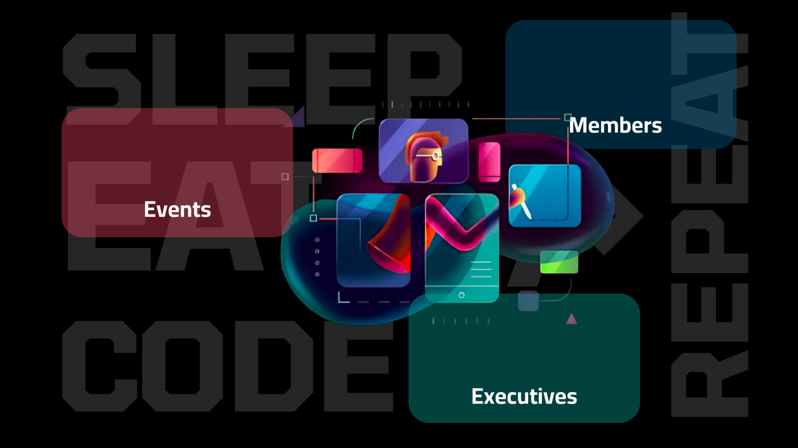

# Open Source Club Website

Welcome to the **Open Source Club Website**! This project is a modern, responsive website for the Open Source Club, designed to showcase club activities, events, staff coordinators, and provide a platform for student registration.

## 🌟 Features
- **Hero Section**: Eye-catching introduction to the club.
- **About Us, Mission & Vision**: Learn about the club's goals and values.
- **Event Counter**: Displays key club statistics.
- **Staff Coordinators**: Carousel of staff members.
- **Registration Form**: Join the club easily.
- **Responsive Design**: Works on all devices.
- **Modern UI**: Built with Bootstrap, Swiper, and Splide for smooth carousels and layouts.

## 📁 Folder Structure
```
├── index.html
├── README.md
├── css/
│   ├── test.css
│   └── styles.css
├── js/
│   └── script.js
├── images/ (or Images/)
│   ├── [all club images and assets]
```

## 🖼️ Gallery
Below are some of the images used in this project:

### Logos & Icons


### Backgrounds & Banners





### Members & Staff


### Other Assets


> **Note:** If your images are in the `Images/` folder, update the paths accordingly in the markdown above.

## 🚀 Technologies Used
- HTML5, CSS3
- Bootstrap 5
- Swiper.js, Splide.js (for carousels)
- Boxicons
- Google Fonts

## 🛠️ How to Run Locally
1. Clone this repository:
   ```bash
   git clone https://github.com/yourusername/your-repo.git
   ```
2. Open `index.html` in your browser.
3. Make sure the `css/`, `js/`, and `images/` (or `Images/`) folders are in the same directory as `index.html`.

## 🤝 Contributing
Pull requests are welcome! For major changes, please open an issue first to discuss what you would like to change.

## 📄 License
[MIT](LICENSE)
